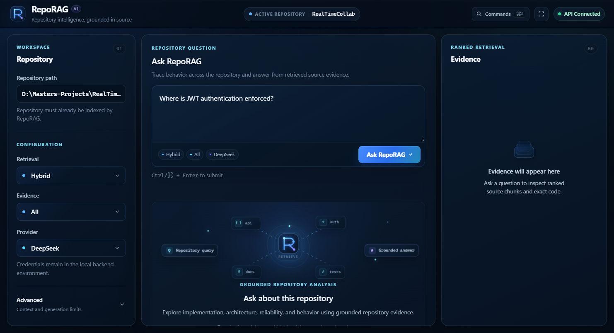
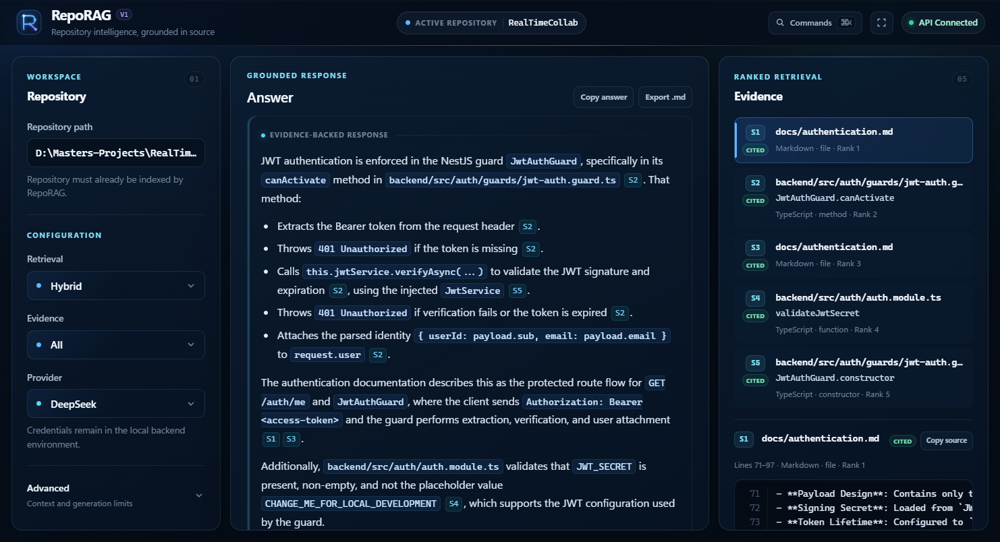
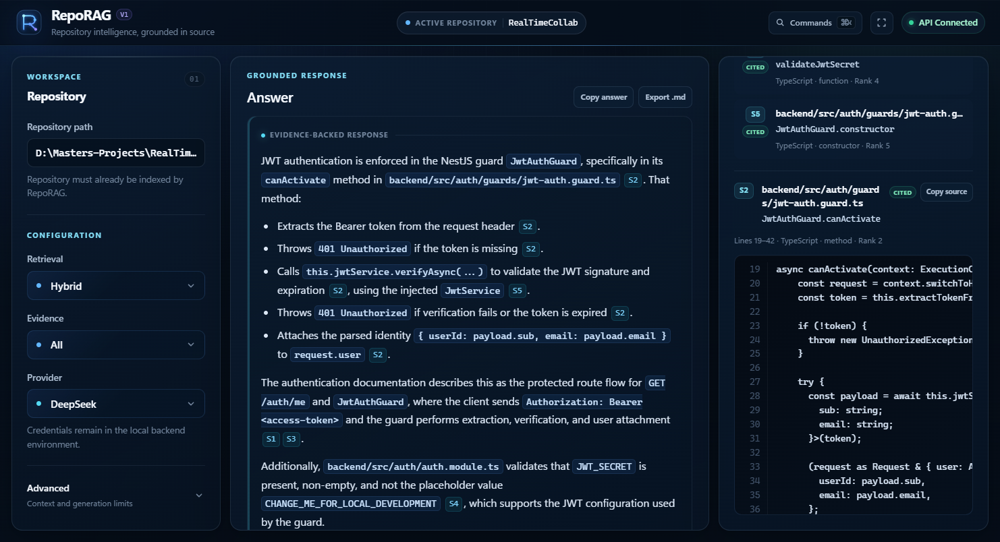
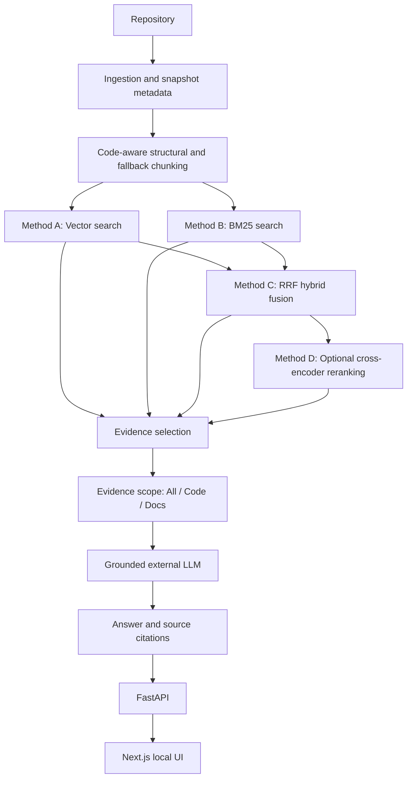

# RepoRAG

RepoRAG is a repository-aware AI code assistant that combines code-aware chunking, semantic retrieval, BM25 lexical search, hybrid rank fusion, optional cross-encoder reranking, and grounded LLM generation to answer questions about software repositories with file-, symbol-, and line-level evidence.

[](https://www.python.org/)
[](frontend/package.json)
[](pyproject.toml)
[](frontend/tsconfig.json)
[](#testing)
[](LICENSE)

## Overview

Point RepoRAG at a local Git repository or supported public GitHub URL, build local retrieval indexes, and ask a repository-level question. RepoRAG retrieves relevant source chunks, sends only the selected evidence to a configured generation provider, validates the returned `[S1]`-style citations, and exposes the exact supporting source through a CLI, local FastAPI service, and Next.js interface.

This is a local developer and research tool, not a hosted service. Its four retrieval methods remain independently selectable and reproducible; no method is presented as universally best.

## Demo / Interface

The interface keeps retrieval configuration beside the question workspace, makes each source citation inspectable down to its original content, and adds a command palette, focus mode, and answer/source export utilities for practical repository analysis.

<p align="center">
  
  <br>
  <em>Main RepoRAG interface</em>
</p>

<p align="center">
  
  <br>
  <em>Grounded answer with validated citations</em>
</p>

<p align="center">
  
  <br>
  <em>Expanded source-code evidence</em>
</p>

## Key Features

- Local Git repository ingestion and cached public GitHub HTTPS ingestion
- Structural, code-aware chunking with deterministic fallback coverage
- Exact semantic retrieval with external Jina code embeddings
- Code-aware BM25 lexical retrieval
- Hybrid Vector + BM25 retrieval using Reciprocal Rank Fusion (RRF)
- Optional external BGE cross-encoder reranking
- Q&A evidence scopes: **All**, **Code**, and **Docs**
- Grounded single-turn answers with file, symbol, and line metadata
- Source-marker citation validation and expandable exact evidence
- DeepSeek, Gemini, and OpenAI generation-provider integrations
- Local FastAPI API and responsive Next.js interface
- Offline automated backend and frontend tests

## Architecture



The selected retrieval method supplies a ranked evidence set. Only that evidence—not the entire repository—is included in the generation request.

## Retrieval Methods

| Method | Implementation | Notes |
| --- | --- | --- |
| **A. Vector** | `jinaai/jina-embeddings-v2-base-code` with normalized 768-dimensional embeddings and exhaustive exact cosine similarity | Semantic retrieval over every frozen chunk |
| **B. BM25** | Exhaustive BM25 with a custom code-aware identifier and path tokenizer | Lexical retrieval for identifiers and exact terminology |
| **C. Hybrid** | Full-ranking Vector + positive-score BM25 fusion using RRF with `k=60` | Default practical method; combines ranks without mixing raw score scales |
| **D. Hybrid + Reranking** | Method C top-50 candidates reranked by `BAAI/bge-reranker-v2-m3` | More computationally expensive, particularly on CPU |

All four methods are selectable through the CLI, API, and interface. The two named retrieval models are external third-party models integrated by RepoRAG and pinned to immutable revisions; see [Vector Retrieval](docs/VECTOR_RETRIEVAL.md) and [Cross-Encoder Reranking](docs/RERANKING.md).

## How It Works

1. Ingest a repository and record its Git snapshot and accepted files.
2. Parse supported languages into structural chunks and cover remaining accepted content with deterministic fallback chunks.
3. Build compatible Vector and BM25 indexes over the same ordered frozen corpus.
4. Retrieve relevant chunks using one selected Method A–D.
5. Optionally filter the ranked candidate pool to All, Code, or Docs evidence.
6. Send the question and selected evidence chunks to the chosen external LLM provider.
7. Validate returned source IDs against the evidence supplied to the model.
8. Display the answer, citations, metadata, and exact source content.

## User Interface

The local web interface provides controls for:

- Repository path
- Question
- Retrieval method
- Evidence scope
- Provider
- Context chunks
- Maximum output tokens

**All** permits both source and documentation, **Code** excludes Markdown documentation, and **Docs** keeps documentation evidence only. Scope filtering preserves the selected retrieval method's ranking and never silently falls back to another scope.

Citation markers are clickable and move focus to the corresponding source card. Evidence content can be expanded without modification. Provider/model, retrieval configuration, citation status, generation latency, and token usage are shown when returned by the backend.

Use **Ctrl/⌘ + K** to open workspace commands. Focus mode prioritizes the answer and evidence panels, while answer and source controls support copying exact generated or retrieved content and exporting the answer as Markdown.

## Technology Stack

| Area | Technologies |
| --- | --- |
| Backend | Python, FastAPI, NumPy, Tree-sitter, Sentence Transformers, PyTorch, custom BM25 implementation |
| Provider SDKs | Google Gen AI SDK (`google-genai`), OpenAI SDK (used for OpenAI and DeepSeek-compatible access) |
| Retrieval models | External `jinaai/jina-embeddings-v2-base-code`, external `BAAI/bge-reranker-v2-m3` |
| Frontend | Next.js, React, TypeScript, Tailwind CSS |
| Testing | Python `unittest`, FastAPI TestClient, Vitest, Testing Library, jsdom |

DeepSeek, Gemini, and OpenAI are external providers; RepoRAG integrates their APIs but does not own their services or models.

## Supported Languages

Structural Tree-sitter chunking currently supports:

- Python
- TypeScript
- TSX
- JavaScript
- JSX, using the canonical JavaScript grammar
- C
- C++

Accepted unsupported languages, configuration files, documentation, parser failures, and files without useful syntax structures use deterministic line-based fallback chunking. See [Code-Aware Chunking](docs/CHUNKING.md) for the exact policy.

## Installation

The current development workflow is Windows-first. RepoRAG declares Python `>=3.11` and has been validated here with Python 3.14.5, Node.js 24.13.1, and Git 2.45.1 on Windows. Next.js requires Node.js 20.9 or newer. Local embedding and reranking models require several gigabytes of disk space; memory use and indexing time depend on repository size and hardware.

```powershell
git clone https://github.com/arsi505/RepoRAG.git
cd RepoRAG

python -m venv .venv
.\.venv\Scripts\Activate.ps1
python -m pip install -e .

cd frontend
npm install
cd ..
```

The editable Python installation is supported by `pyproject.toml` and its `src/` package layout.

## Provider Configuration

Copy the backend placeholder file and add only the provider keys you intend to use:

```powershell
Copy-Item .env.example .env
```

```dotenv
DEEPSEEK_API_KEY=
GEMINI_API_KEY=
OPENAI_API_KEY=
```

The root `.env` is gitignored and loaded only by the Python backend. Provider keys must never be placed in a `NEXT_PUBLIC_*` variable.

The frontend defaults to the loopback API URL. To override it, copy `frontend/.env.example` to `frontend/.env.local`:

```dotenv
NEXT_PUBLIC_REPORAG_API_URL=http://127.0.0.1:8000
```

## Indexing a Repository

The web interface deliberately has no indexing endpoint. Prepare a repository from the project root before using it in the UI. The following commands are the verified local workflow for `D:\Masters-Projects\RealTimeCollab`:

```powershell
$env:PYTHONPATH = "$PWD\src"

# 1. Optional metadata-only ingestion audit
.\.venv\Scripts\python.exe -m reporag.ingestion.cli `
  "D:\Masters-Projects\RealTimeCollab"

# 2. Generate the deterministic frozen chunk corpus
.\.venv\Scripts\python.exe -m reporag.chunking.cli `
  "D:\Masters-Projects\RealTimeCollab"

# 3. Build the exact Vector index
.\.venv\Scripts\python.exe -m reporag.embeddings.cli build `
  "D:\Masters-Projects\RealTimeCollab"

# 4. Build the BM25 index over the same frozen corpus
.\.venv\Scripts\python.exe -m reporag.lexical.cli build `
  "D:\Masters-Projects\RealTimeCollab"
```

The build CLIs ingest and validate the repository snapshot and shared chunk corpus. Output is stored under `data/chunks/realtimecollab.jsonl`, `data/embeddings/realtimecollab/`, and `data/bm25/realtimecollab/`.

Initial Vector construction can be slow on CPU because every chunk is encoded by the pinned embedding model. Model files and generated indexes are cached locally and should be reused while the repository snapshot remains compatible. Runtime chunks, indexes, repository clones, and model caches are intentionally gitignored.

Public GitHub HTTPS URLs can be supplied instead of a local path, for example `https://github.com/owner/repository.git`. Public repositories are cloned into the local ignored repository cache.

## Running the Application

Start the API in the first PowerShell terminal:

```powershell
cd D:\Masters-Projects\RepoRAG
.\.venv\Scripts\Activate.ps1
uvicorn reporag.api.app:app --reload --host 127.0.0.1 --port 8000
```

Start the frontend in a second terminal:

```powershell
cd D:\Masters-Projects\RepoRAG\frontend
npm run dev
```

Open [http://localhost:3000](http://localhost:3000). The UI calls `GET /health` once on load to display API connectivity. The API binds to loopback and accepts Q&A only for repositories with compatible prebuilt indexes.

## CLI Usage

Ask a grounded DeepSeek question with Hybrid retrieval, code-only evidence, five context chunks, and a 2,000-token answer limit:

```powershell
$env:PYTHONPATH = "$PWD\src"
.\.venv\Scripts\python.exe -m reporag.qa.cli `
  data\embeddings\realtimecollab `
  data\bm25\realtimecollab `
  "Where is JWT authentication enforced?" `
  --provider deepseek `
  --method hybrid `
  --context-k 5 `
  --evidence-scope code `
  --max-output-tokens 2000
```

Add `--dry-run --show-context` to inspect retrieval and the exact evidence context without calling a generation provider.

## Example Output

Illustrative only—the exact retrieved order and generated wording depend on the indexed repository snapshot and provider response:

```text
Question: Where is JWT authentication enforced?

Answer: JWT authentication is enforced by JwtAuthGuard.canActivate [S2].

[S2] backend/src/auth/guards/jwt-auth.guard.ts
     JwtAuthGuard.canActivate
     lines 19–42
```

## Practical Validation

RepoRAG has been exercised against:

- **RealTimeCollab** — TypeScript/NestJS real-time collaboration backend
- **Reloop** — larger TypeScript reliability and job-processing system
- **ArsiShell** — C++ shell implementation

These practical checks produced grounded source citations across TypeScript and C++ repositories. Large-repository testing also exposed ingestion pollution, embedding-batch sizing, generation-limit, and documentation-dominance issues that were addressed without changing Methods A–D. This is practical validation, not a scientific benchmark result.

## Research Context

The original research design asks how Vector, BM25, Hybrid, and Hybrid-plus-reranking strategies affect repository-level retrieval effectiveness and latency. That methodology remains frozen in [RESEARCH_PLAN.md](RESEARCH_PLAN.md). Empirical benchmark construction and research evaluation are separate future work; this repository does not claim measured Recall@k, MRR, or statistical results.

## Testing

Current offline validation comprises 224 Python tests and 14 frontend tests:

```powershell
# Backend
$env:PYTHONPATH = "$PWD\src"
.\.venv\Scripts\python.exe -m unittest discover -s tests -v
.\.venv\Scripts\python.exe -m pip check

# Frontend
cd frontend
npm test
npm run lint
npm run build
npm audit --omit=dev
```

Provider tests use fakes or mocks and do not make live LLM calls.

## Project Structure

```text
RepoRAG/
├── src/reporag/
│   ├── ingestion/
│   ├── chunking/
│   ├── embeddings/
│   ├── lexical/
│   ├── retrieval/
│   ├── fusion/
│   ├── reranking/
│   ├── generation/
│   ├── qa/
│   └── api/
├── frontend/
├── tests/
├── docs/
├── evaluation/
├── results/
└── data/
```

Generated data beneath `data/`—including repository caches, chunks, model caches, and retrieval indexes—is local runtime state and is ignored. Future sanitized evaluation datasets and final research-result tables are not globally ignored.

## Limitations

- Initial Vector index construction can be slow on CPU.
- Cross-encoder reranking is significantly slower than Hybrid retrieval on CPU.
- Repositories must be indexed before they can be queried through the web interface.
- Grounding quality depends on whether the selected retrieval method returns sufficient evidence.
- Code-only filtering does not guarantee that the exact implementation symbol appears in the selected top-k evidence.
- Citation validation confirms that referenced source IDs were supplied; it does not prove full semantic entailment for every claim.
- The local UI/API workflow is the primary supported usage. No hosted deployment, accounts, or multi-user isolation are provided.
- A live Q&A request sends the selected evidence chunks to the chosen external LLM provider.

## Privacy and Data Handling

Repository ingestion, chunking, and index construction happen locally. Generated chunks, model caches, and indexes remain on the local machine. Provider API keys stay in the backend environment and are not exposed through the frontend.

During live Q&A, only the selected evidence chunks and question are sent to the configured external provider—DeepSeek, Google Gemini, or OpenAI. Users should review the selected provider's data policies before using proprietary or sensitive source code. RepoRAG does not claim complete local privacy when an external generation provider is enabled.

## Documentation

- [Repository Ingestion](docs/INGESTION.md)
- [Code-Aware Chunking](docs/CHUNKING.md)
- [Vector Retrieval](docs/VECTOR_RETRIEVAL.md)
- [BM25 Retrieval](docs/BM25_RETRIEVAL.md)
- [Hybrid Retrieval](docs/HYBRID_RETRIEVAL.md)
- [Cross-Encoder Reranking](docs/RERANKING.md)
- [Repository Q&A](docs/REPOSITORY_QA.md)
- [Local API](docs/API.md)
- [Screenshot Guide](docs/images/README.md)
- [Research Plan](RESEARCH_PLAN.md)
- [Changelog](CHANGELOG.md)

## License

RepoRAG is available under the [MIT License](LICENSE). Third-party models, SDKs, and dependencies retain their own licenses and terms.
